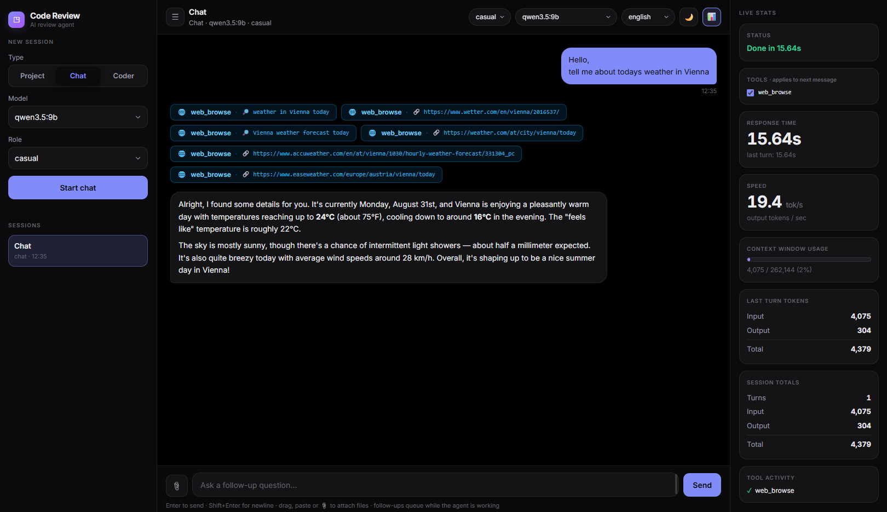
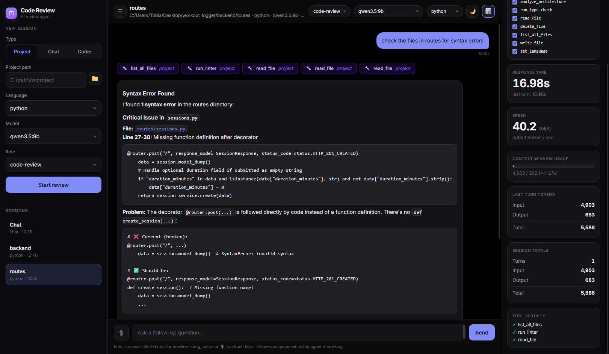

# Code Review Agent

A local-first coding assistant with a browser UI for reviewing, explaining, planning, implementing, and validating code. It uses LangChain/LangGraph for agent workflows and Ollama for local models.

## Screenshots
### Chat

### Code Review


## Features

- Browser-based chat UI with project, chat, and Coder modes.
- Configurable roles and Ollama models in `config.yaml`.
- Multi-stage Coder workflow:

  ```text
  orchestrator -> scaffold -> architect -> coder -> validator -> inspector
  ```

- Language-aware linting, testing, type checking, import checks, and architecture analysis for Python, JavaScript/TypeScript, Go, Rust, and Java.
- File snapshots for restoring changes made by the agent.
- Optional web browsing and file attachments in the UI.
- SQLite-backed checkpoints and local session transcripts for resuming work.

This project is experimental. Agents can modify or delete files in the selected project, so use a disposable clone or review changes before accepting them.

## Requirements

- Python 3.10 or newer
- [Ollama](https://ollama.com/) running locally
- [Docker Desktop](https://www.docker.com/products/docker-desktop/) with `docker` available on `PATH`

Docker is used by the language tooling to run linters, tests, compilers, and import checks in language-specific environments.

## Installation

```bash
git clone <repository-url>
cd code_review_agent
python -m venv .venv
```

Activate the virtual environment and install the dependencies:

```bash
# Windows PowerShell
.venv\Scripts\Activate.ps1

# macOS/Linux
# source .venv/bin/activate

python -m pip install -r requirements.txt
```

Start Ollama and pull the models selected in the configuration files. The current defaults include:

```bash
ollama pull qwen3.5:9b
ollama pull qwen3.6:35b-a3b
```

If you use different models, update `config.yaml` and `agents/implementations/code_agent/graph_config.yaml` accordingly.

## Run the web UI

From the repository root:

```bash
python ui/server.py
```

Open [http://127.0.0.1:8765](http://127.0.0.1:8765) in a browser. The server listens on loopback only and does not provide authentication; do not expose it directly to the internet.

## Run the standalone validator

`main.py` runs the validator against selected files without starting the web UI:

```bash
python main.py \
  --project /path/to/project \
  --files src/foo.py src/bar.py \
  --language python
```

Supported language values are `python`, `javascript`, `typescript`, `go`, `rust`, and `java`.

## Configuration

- `config.yaml` — standard agent roles, model settings, prompts, and the default recursion limit.
- `agents/implementations/code_agent/graph_config.yaml` — models, prompts, and behavior for the multi-stage Coder workflow.
- `tools.json` — tool metadata used by the project.

The default model configuration targets Ollama's OpenAI-compatible endpoint at `http://localhost:11434/v1`.

## Runtime files and public repositories

The application writes local state while it runs:

- `ui/sessions.json` contains session metadata, paths, and conversation transcripts.
- `ui/checkpoints.db` contains LangGraph checkpoints.

These files may contain private project information and should not be committed to a public repository. Other local artifacts such as `.venv/`, `.coverage`, `__pycache__/`, `.idea/`, and `.toolenvs/` should also remain untracked.