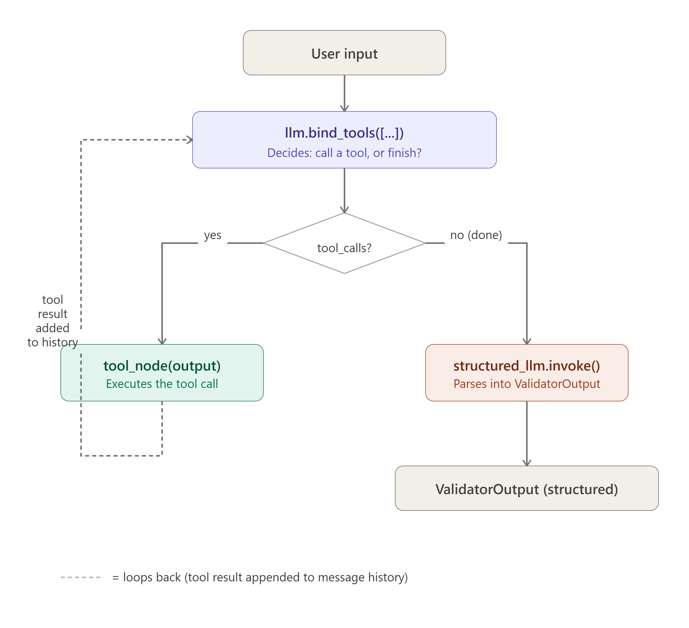

## Tool structured output flow
---

Agent has two modes (two llm's) - a "thinking" mode where it can call tools and a "finishing" mode where it produces a clean structured output. Never do both at once!
